# React Component Architecture - Ingredients Scanner

## Component Relationship Diagram

```mermaid
graph TB
    %% Main App Component
    App[App.tsx<br/>Main Application State Manager]
    
    %% View Components
    ScanView[ScanView.tsx<br/>Camera & Capture Logic]
    PrepareView[PrepareView.tsx<br/>Image Cropping]
    ResultView[ResultView.tsx<br/>Analysis Display]
    
    %% Layout Components
    VerticalMainLayout[VerticalMainLayout.tsx<br/>Layout Container]
    
    %% Feature Components
    CameraPreview[CameraPreview.tsx<br/>Camera Stream]
    AnalysisResult[AnalysisResult.tsx<br/>Results Display]
    ListsButtons[ListsButtons.tsx<br/>List Navigation]
    ApiKeyManager[ApiKeyManager.tsx<br/>API Key Dialog]
    IngredientLists[IngredientLists.tsx<br/>Lists Management]
    CameraPermissionInfo[CameraPermissionInfo.tsx<br/>Permission Info]
    
    %% Debug Components
    DebugOverlay[DebugOverlay.tsx<br/>Debug Information]
    
    %% Services
    OpenAIService[OpenAIService<br/>AI Analysis]
    TesseractService[TesseractService<br/>OCR Processing]
    IngredientListService[IngredientListService<br/>List Management]
    
    %% App State & Navigation
    App -->|view: 'scan'| ScanView
    App -->|view: 'prepare'| PrepareView
    App -->|view: 'result'| ResultView
    App -->|showApiKeyManager| ApiKeyManager
    App -->|showIngredientLists| IngredientLists
    App -->|cameraPermission: 'denied'| CameraPermissionInfo
    App -->|debugInfo| DebugOverlay
    
    %% ScanView Dependencies
    ScanView -->|uses| VerticalMainLayout
    ScanView -->|uses| CameraPreview
    ScanView -->|uses| ListsButtons
    ScanView -->|onCapture| App
    
    %% PrepareView Dependencies
    PrepareView -->|uses| VerticalMainLayout
    PrepareView -->|uses| ListsButtons
    PrepareView -->|uses Cropper| CropperComponent[Cropper.js<br/>Image Cropping]
    PrepareView -->|onCropDone| App
    PrepareView -->|onDebugInfo| App
    
    %% ResultView Dependencies
    ResultView -->|uses| VerticalMainLayout
    ResultView -->|uses| ListsButtons
    ResultView -->|uses| AnalysisResult
    
    %% AnalysisResult Dependencies
    AnalysisResult -->|uses| IngredientListService
    
    %% ListsButtons Dependencies
    ListsButtons -->|uses| IngredientListService
    ListsButtons -->|onShowLists| App
    
    %% Service Dependencies
    App -->|analyzeIngredients| OpenAIService
    App -->|extractIngredients| TesseractService
    PrepareView -->|detectAdaptiveCrop| TesseractService
    AnalysisResult -->|getPositiveList| IngredientListService
    AnalysisResult -->|getNegativeList| IngredientListService
    AnalysisResult -->|addToPositiveList| IngredientListService
    AnalysisResult -->|addToNegativeList| IngredientListService
    
    %% Layout Structure
    VerticalMainLayout -->|top| ListsButtons
    VerticalMainLayout -->|middle| ContentArea[Content Area<br/>CameraPreview/AnalysisResult/etc.]
    VerticalMainLayout -->|bottom| ActionButtons[Action Buttons<br/>Scan/Crop/Close]
    
    %% Styling
    classDef mainComponent fill:#e1f5fe,stroke:#01579b,stroke-width:2px
    classDef viewComponent fill:#f3e5f5,stroke:#4a148c,stroke-width:2px
    classDef layoutComponent fill:#e8f5e8,stroke:#1b5e20,stroke-width:2px
    classDef featureComponent fill:#fff3e0,stroke:#e65100,stroke-width:2px
    classDef serviceComponent fill:#fce4ec,stroke:#880e4f,stroke-width:2px
    classDef externalComponent fill:#f1f8e9,stroke:#33691e,stroke-width:2px
    
    class App mainComponent
    class ScanView,PrepareView,ResultView viewComponent
    class VerticalMainLayout layoutComponent
    class CameraPreview,AnalysisResult,ListsButtons,ApiKeyManager,IngredientLists,CameraPermissionInfo featureComponent
    class OpenAIService,TesseractService,IngredientListService serviceComponent
    class CropperComponent,DebugOverlay externalComponent
```



## Component Hierarchy & Data Flow

### 1. **App.tsx** - Central State Manager
- **State Management**: Manages all application state (view, images, analysis, errors)
- **Navigation Control**: Handles transitions between Scan → Prepare → Result views
- **Service Coordination**: Orchestrates OpenAI and Tesseract services
- **Dialog Management**: Controls API key manager and ingredient lists dialogs

### 2. **View Components** - Main Application Views
- **ScanView**: Camera capture with automatic cropping
- **PrepareView**: Manual image cropping with adaptive detection
- **ResultView**: Analysis results display with actions

### 3. **Layout Components** - Structure & Organization
- **VerticalMainLayout**: Consistent 3-section layout (top/middle/bottom)
- **ListsButtons**: Navigation to ingredient lists (always in top section)

### 4. **Feature Components** - Specific Functionality
- **CameraPreview**: Camera stream handling with screenshot capability
- **AnalysisResult**: Ingredient display with intolerance checking
- **ApiKeyManager**: ChatGPT API key configuration dialog
- **IngredientLists**: Positive/negative ingredient list management
- **CameraPermissionInfo**: Camera permission error display

### 5. **Services** - Business Logic
- **OpenAIService**: AI-powered ingredient analysis
- **TesseractService**: OCR text extraction and adaptive cropping
- **IngredientListService**: Local storage for ingredient lists

## Key Data Flow Patterns

### 1. **Image Processing Flow**
```
ScanView → App → PrepareView → App → ResultView → AnalysisResult
```

### 2. **Service Integration**
```
App → OpenAIService (AI Analysis)
App → TesseractService (OCR)
PrepareView → TesseractService (Adaptive Cropping)
AnalysisResult → IngredientListService (List Management)
```

### 3. **State Management**
```
App (Central State) → View Components (Props)
View Components → App (Event Handlers)
```

### 4. **Layout Consistency**
```
All Views → VerticalMainLayout → Consistent UI Structure
```

## Component Responsibilities

| Component | Primary Responsibility | Key Props/Events |
|-----------|----------------------|------------------|
| **App** | State management, navigation, service coordination | `view`, `capturedImage`, `analysis` |
| **ScanView** | Camera capture, automatic cropping | `onCapture`, `cameraPermission` |
| **PrepareView** | Manual cropping, adaptive detection | `onCropDone`, `onDebugInfo` |
| **ResultView** | Results display, error handling | `analysis`, `isAnalyzing`, `error` |
| **AnalysisResult** | Ingredient display, intolerance checking | `analysis`, `onActionDone` |
| **VerticalMainLayout** | Consistent layout structure | `top`, `middle`, `bottom` |
| **ListsButtons** | List navigation | `onShowLists` |
| **CameraPreview** | Camera stream management | `cameraId`, `ref` |

## Design Patterns Used

1. **Container/Presentational Pattern**: App as container, views as presentational
2. **Layout Composition**: VerticalMainLayout for consistent structure
3. **Service Layer**: Business logic separated into services
4. **Event-Driven Communication**: Props down, events up
5. **Memoization**: React.memo for performance optimization
6. **Refs for Imperative APIs**: CameraPreview and Cropper integration 